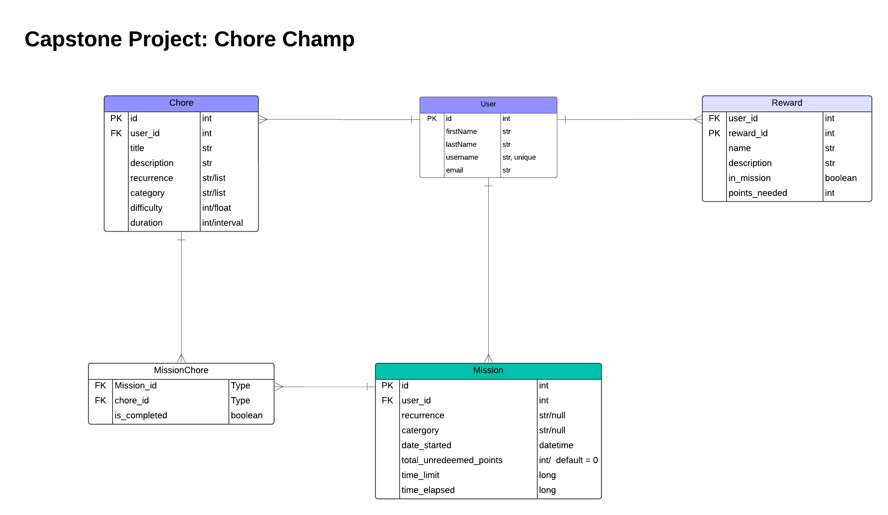

# ChoreChampAPI: A Spring Boot API for Chore and Mission Management

ChoreChamp is a full stack application designed to help users manage their chores, missions, and rewards efficiently. This Spring Boot API provides a robust backend for creating, updating, and tracking household tasks and personal goals.

## ER Diagram



### Key Files and Folders:
- `ada.chore_api_v2`: Holds the folders for each entity. Each entity folder contains its class, controller, service,
repository and response body file.
- `pom.xml`: Maven project configuration file.
- `application.properties`: Configuration file for Spring Boot application settings.
- `ChoreApiV2Application.java`: The main entry point for the Spring Boot application.

### Important Integration Points:
- `DatabaseConfig.java`: Configures a deployed database connection using HikariCP.
- Controller classes (e.g., `UserController.java`, `ChoreController.java`): Define RESTful API endpoints.
- Repository interfaces: Provide data access methods for interacting with the database.

## Usage Instructions

### Installation

Prerequisites:
- Java Development Kit (JDK) 17 or later
- Maven 3.6 or later
- PostgreSQL 12 or later

Steps:
1. Clone the repository and open project in an IDE:
   ```
   git clone <repository-url>
   cd chore-api-v2
   ```

2. Create a postgresSQL database for the api. 
3. Create a `env.properties` file in the project root folder, add it to the `.gitignore`, and add the following content:
   ```
   DATABASE_URL=jdbc:postgresql://<host>:<port>/<database>
   SPRING_DATASOURCE_USERNAME=<username>
   SPRING_DATASOURCE_PASSWORD=<password>
   SPRING_HIBERNATE_DDL_AUTO=<update | create-drop>
   ```

3. Build the project:
   ```
   ./mvnw clean install
   ```

4. Run the application:
   ```
   ./mvnw spring-boot:run
   ```

### Getting Started

Once the application is running, you can interact with the API using HTTP requests. Here are some example endpoints:

1. Create a new user:
   ```
   POST /users
   {
     "username": "johndoe",
     "firstName": "John",
     "lastName": "Doe",
     "email": "john@example.com"
   }
   ```

2. Create a new chore for a user:
   ```
   POST /users/{userId}/chores
   {
     "title": "Clean Kitchen",
     "description": "Wipe counters and mop floor",
     "recurrence": "Daily",
     "category": "Kitchen",
     "duration": 30,
     "difficulty": 2
   }
   ```

3. Get all chores for a user:
   ```
   GET /users/{userId}/chores
   ```

### Troubleshooting

1. Database connection issues:
   - Ensure PostgreSQL is running and accessible.
   - Verify the connection details in `env.properties`.
   - Check the application logs for specific error messages.

2. API errors:
   - Verify the request format and payload.
   - Check the response status code and error message.

## Data Flow

The ChoreChamp API follows a typical Spring Boot MVC architecture:

1. Client sends an HTTP request to a specific endpoint.
2. The appropriate Controller receives the request and validates the input.
3. The Controller delegates business logic to the corresponding Service.
4. The Service interacts with one or more Repositories to perform CRUD operations on the database.
5. The Service processes the data and returns it to the Controller.
6. The Controller formats the response and sends it back to the client.

```
Client <-> Controller <-> Service <-> Repository <-> Database
```

Note: The application uses Spring Data JPA for database interactions, which simplifies data access and management.

## 🚀 Contact Us
### Amber Edwards - Fullstack SWE
[](https://www.linkedin.com/in/amber-edwards-swe/)
[](https://github.com/Msambere)
[](mailto:a.r.a.edwards@gmail.com)
### Anh Tran - Fullstack SWE
[](https://www.linkedin.com/in/anhtran077/)
[](https://github.com/momofAnAl)
[](mailto:anhtr077@gmail.com)

### Salma Anany - Fullstack SWE
[](https://www.linkedin.com/in/salma-anany/)
[](https://github.com/SalmaAnany)
[](mailto:salmayousry5@gmail.com)